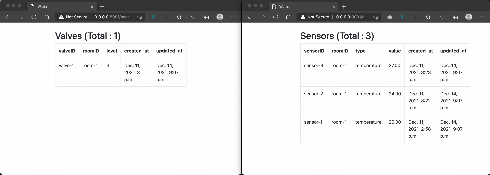

# WattX Coding Project

## Problem Statement

For this task, you will need to prototype a simple heating control service.

Imagine that you have a single room with a few temperature sensors installed there and a radiator valve you can control.

Your task is to keep the room temperature at 22C by setting the valve openness from 0 (fully closed) to 100 (fully open). The current room temperature is indicated by sensor readings.

The temperature sensors send the readings periodically to the mqtt topic. You can set the valve openness by sending a specific message to a specific mqtt topic.


### Input

You get the periodic temperature readings on the topic `/readings/temperature` in the json format:


```json
{
  "sensorID": "sensor-1",
  "type": "temperature",
  "value": 25.3
}
```

Receiving this message should indicate that Sensor 1 reads 25.3C for the area of the room where it has been installed.


### Output

You will need to send the valve openness value to the topic `/actuators/room-1` in the json format:

```json
{
  "level": 14
}
```

Sending the message indicates that the valve should be set to 14% openness.

## Project Setup

pre-requisites
- docker
- docker-compose

### Setup 

```
git clone https://github.com/raunaqness/wattx
cd wattx

# build docker image
./build.sh
```

### start project

```
docker-compose up
```

### overview of project and features implemented


- Project is built using Python and Django web framework
- Models for Sensor, Valve and Room are defined in `wattx/heating_control/models.py`
- `MySQL` is used as the DB for data persistence simply because it's the default DB setup in Django. In a production setting, would use `PostgreSQL`
- `toke/mosquitto` docker image is used for MQTT Broker (see `docker-compose.yml`)
- Django web server is running on `http://0.0.0.0:8000` and 3 endpoints are defined (the pages auto-refresh every second), which show the current values of the following : 
    - Sensors : `http://0.0.0.0:8000/heating_control/sensors`
    - Valves : `http://0.0.0.0:8000/heating_control/valves`
    - Rooms : `http://0.0.0.0:8000/heating_control/valves`
- An MQTT subscriber is also running as a daemon in `wattx` service - `wattx/mqtt_utils/mqtt_subscriber.py` which reads messages from topics defined in `wattx/mqtt_utils/constants.py` including `/readings/temperature` and calls the appropriate function
- The service `random-sensor-data-generator` (see `docker-compose.yml`) runs a script that sends random temperature data for random sensors to the topic `/readings/temperature` just to showcase the end-to-end functionality of the app. If you open the both urls (Sensors and Valves) in seperate browser windows side by side, you can see the changes in **Sensor** temperature values and subsequent changes in the value of **Valve** openness.
- the app support having many Sensors in many Rooms. Also added a parameter to define whether a Motion Sensor is active or not.




